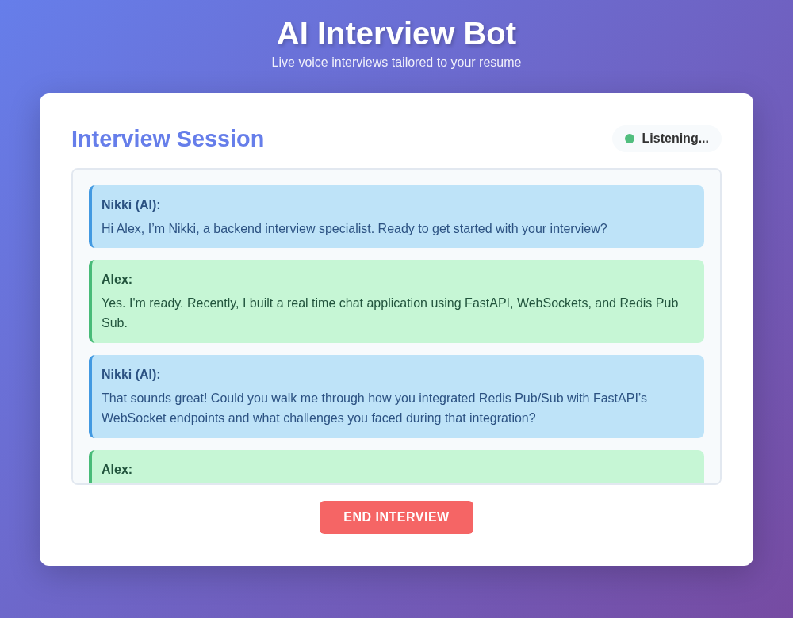
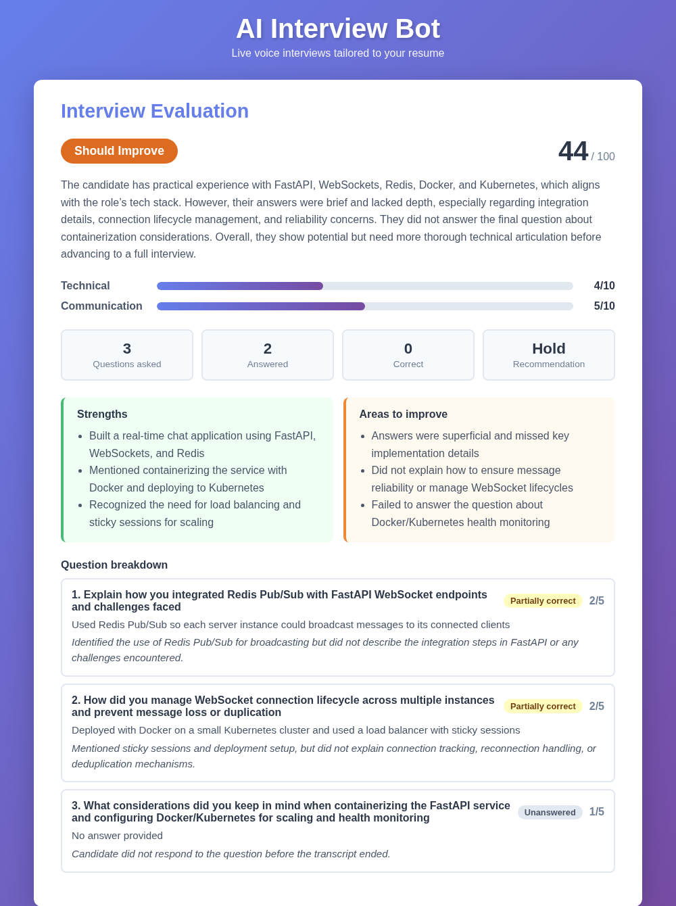
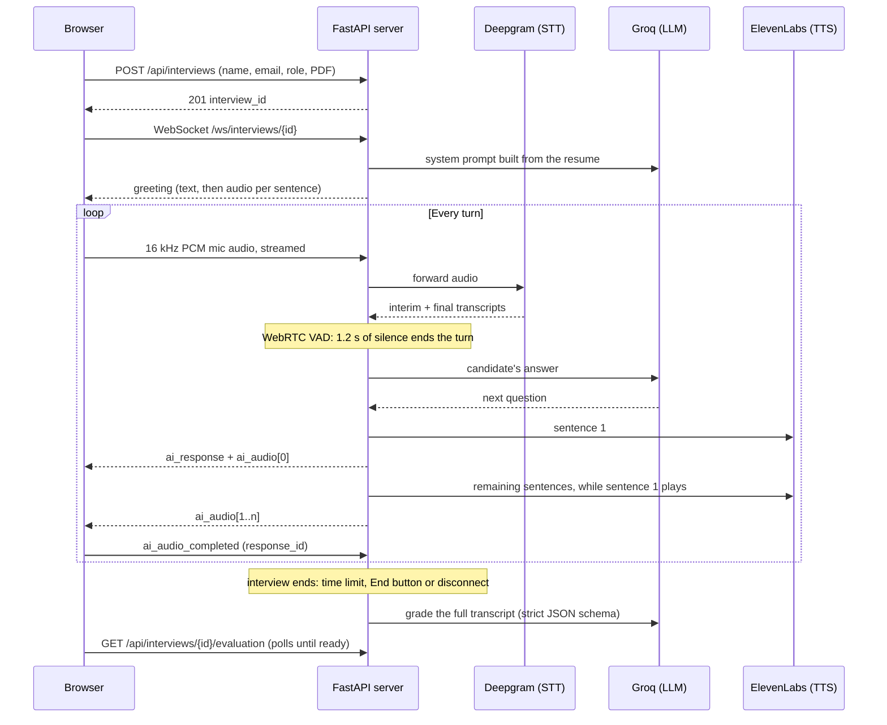
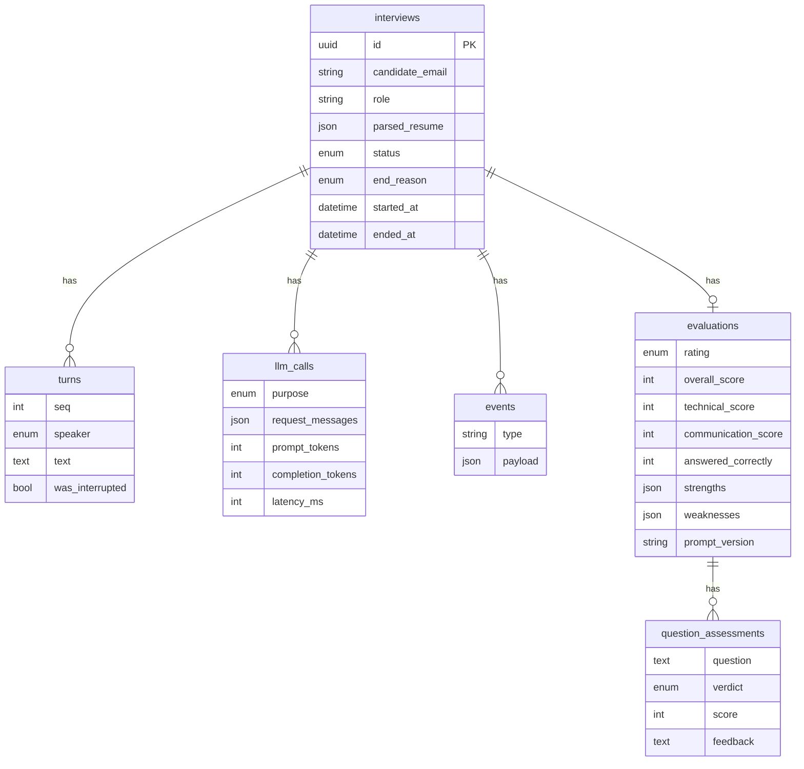

# AI Interview Bot

[](https://github.com/MohitChandran/AI_Interviewer/actions/workflows/ci.yml)

[](LICENSE)

A real-time voice interviewer. A candidate uploads their resume, and an AI interviewer named **Nikki** runs a spoken interview with questions drawn from that resume: the candidate talks, Nikki listens and replies out loud, and the candidate can interrupt her mid-sentence. When the interview ends, a second LLM pass grades the full transcript and the candidate gets a scored evaluation.

| Live interview | Evaluation |
| --- | --- |
|  |  |

## Engineering highlights

- **~2.3 s from the candidate's last word to Nikki's voice, down from ~5 s.** Measured per turn from recorded timings, then fixed where the time actually went:
  - Replies are voiced sentence by sentence: the first sentence is synthesized and sent alone, and the rest are synthesized while it plays ([`session.py`](backend/interview/session.py) `_speak`).
  - Connections to Groq and ElevenLabs are kept alive between turns. httpx's 5 s idle timeout is shorter than a candidate's answer, so every turn was paying a fresh TLS handshake (200–400 ms).
  - 1.2 s of the remaining time is a deliberate end-of-turn silence so Nikki doesn't cut people off mid-thought.
- **Turn-taking is an explicit state machine** (`LISTENING → THINKING → SPEAKING`). Only final speech-to-text results enter the transcript, late words don't count as interruptions, and every reply carries an ID so a stale "audio finished" message can't end a newer reply. Each of those was a real bug found in a live test, and each has a regression test.
- **Structured, deterministic grading.** The evaluator must return JSON matching a Pydantic schema, which Groq enforces in strict mode and the code validates again. The LLM scores the dimensions, and plain code turns those scores into the overall score and rating, so the same scores always give the same label ([`evaluation.py`](backend/interview/evaluation.py)).
- **Everything is persisted and observable.** Transcripts, every LLM request (exact messages, tokens, latency), a per-reply latency breakdown and a timeline of events go to SQLite through async SQLAlchemy with Alembic migrations. Every log line is tagged with its interview ID through a `contextvar`, including lines from background tasks and worker threads.
- **Failure isolation.** A database error never drops a live interview ([`recorder.py`](backend/interview/recorder.py)). Opening one interview link from two tabs can't start two sessions, because the claim is an atomic `UPDATE ... WHERE status = 'created'`. A server restart marks orphaned interviews and evaluations instead of leaving them "in progress" forever.
- **Tested without the network.** Every provider is faked, and each test gets its own temporary SQLite file. A test fails if the models and migrations drift apart. CI runs ruff and pytest on Python 3.10 and 3.12, and checks that the Docker image starts and reports healthy.

## How it works



1. **Resume parsing:** `pdfplumber` extracts the text, and pattern matching pulls out skills, projects, experience and education for the interviewer's prompt.
2. **Speech-to-text:** the browser captures the mic as 16 kHz PCM and streams it over the WebSocket to Deepgram's live transcription.
3. **Turn detection:** WebRTC VAD watches for silence after speech. The server then waits briefly for Deepgram to finalize the last words before sending the turn to the LLM.
4. **Interviewer:** a Groq-hosted LLM plays Nikki, using a system prompt built from the resume and a bounded conversation history.
5. **Text-to-speech:** ElevenLabs voices the reply sentence by sentence, and the browser plays the chunks back to back.
6. **Barge-in:** two or more words from the candidate while Nikki is speaking stop playback and hand the turn back.
7. **Evaluation:** a separate, higher-effort LLM call grades the whole transcript against a rubric (versioned in [`prompts.py`](backend/interview/prompts.py)), and the browser shows the result.

## Tech stack

| Layer | Technology |
| --- | --- |
| Backend | Python, FastAPI, WebSockets, asyncio |
| LLM | Groq (GPT-OSS 120B by default) |
| Speech-to-text | Deepgram (Nova-2, streaming) |
| Text-to-speech | ElevenLabs (Flash v2.5, REST) |
| Voice activity detection | WebRTC VAD |
| Database | SQLite, SQLAlchemy 2.0 (async), Alembic |
| Frontend | Vanilla JS, Web Audio API |
| Tooling | pytest, ruff, GitHub Actions, Docker |

## Getting started

**Prerequisites:** Python 3.10+ and API keys for [Groq](https://console.groq.com), [Deepgram](https://console.deepgram.com) and [ElevenLabs](https://elevenlabs.io). All three have free tiers.

```bash
git clone https://github.com/MohitChandran/AI_Interviewer.git
cd AI_Interviewer

python -m venv .venv
source .venv/bin/activate
pip install -r requirements.txt

cp .env.example .env   # then fill in your three API keys
python -m backend.main
```

Open http://localhost:8000, fill in the form, upload a PDF resume and click **Start Interview**. Use headphones: without them, Nikki's own voice can be picked up by the mic and count as an interruption.

The SQLite database is created at `data/interview_bot.db`, and migrations run automatically at startup. Interactive API docs are at http://localhost:8000/docs.

### With Docker

```bash
docker build -t interview-bot .
docker run --env-file .env -p 8000:8000 -v "$(pwd)/data:/app/data" interview-bot
```

The volume keeps the database outside the container, so it survives rebuilds.

### Development

```bash
pip install -r requirements-dev.txt
pytest                                            # no API keys needed
ruff check . && ruff format --check .
alembic revision --autogenerate -m "describe it"  # after changing backend/db/models.py
```

## Configuration

All settings are read from `.env` (see [.env.example](.env.example)). Only the three API keys are required.

| Variable | Default | Description |
| --- | --- | --- |
| `GROQ_API_KEY` | none | Groq API key |
| `DEEPGRAM_API_KEY` | none | Deepgram API key |
| `ELEVENLABS_API_KEY` | none | ElevenLabs API key |
| `GROQ_MODEL` | `openai/gpt-oss-120b` | Interviewer model (`qwen/qwen3.8-27b` answers about 2× faster) |
| `LLM_REASONING_EFFORT` | `low` | Reasoning effort for reasoning models; empty to disable |
| `ELEVENLABS_VOICE_ID` | `EXAVITQu4vr4xnSDxMaL` | ElevenLabs voice |
| `ELEVENLABS_MODEL` | `eleven_flash_v2_5` | ElevenLabs TTS model |
| `DEEPGRAM_MODEL` | `nova-2` | Deepgram STT model |
| `INTERVIEW_DURATION_MINUTES` | `10` | Interview length |
| `SILENCE_THRESHOLD_SECONDS` | `1.2` | Silence that ends the candidate's turn |
| `BARGE_IN_MIN_WORDS` | `2` | Words needed while Nikki talks to count as an interruption |
| `INTERVIEW_LINK_TTL_MINUTES` | `30` | Unstarted interviews expire after this |
| `MAX_RESUME_MB` | `5` | Largest accepted resume |
| `EVALUATION_MODEL` | `openai/gpt-oss-120b` | Model that grades the interview |
| `EVALUATION_REASONING_EFFORT` | `medium` | Reasoning effort for grading |
| `DATABASE_URL` | `sqlite+aiosqlite:///data/interview_bot.db` | SQLAlchemy async database URL |
| `LOG_LEVEL` | `INFO` | Log level |
| `LOG_FORMAT` | `text` | `text`, or `json` for one JSON object per line |

## API

| Method | Path | Description |
| --- | --- | --- |
| `GET` | `/health` | Database connectivity and which providers are configured |
| `POST` | `/api/interviews` | Multipart `name`, `email`, `role`, `resume` (PDF, checked by content). Returns `201` |
| `GET` | `/api/interviews` | List interviews, newest first. Query: `status`, `limit`, `offset` |
| `GET` | `/api/interviews/{id}` | Interview with transcript, LLM call metadata and events |
| `DELETE` | `/api/interviews/{id}` | Delete an interview and its resume. `409` while in progress |
| `GET` | `/api/interviews/{id}/evaluation` | The evaluation; `status` is `pending` until ready |
| `POST` | `/api/interviews/{id}/evaluation` | Regenerate the evaluation (`202`). `409` unless the interview has ended |
| `WS` | `/ws/interviews/{id}` | Live interview stream; each interview can be started once |

**WebSocket protocol.** The client sends binary frames of 16 kHz mono 16-bit PCM, plus JSON `{"type": "ai_audio_completed", "response_id": n}` and `{"type": "stop"}`. For each reply the server sends `ai_response` (`response_id`, `text`, `chunks`), then one `ai_audio` per sentence (`response_id`, `index`, base64 MP3). It also sends `candidate_transcript`, `stop_ai_audio` (on barge-in), `interview_end` and `error`.

## Data model



- **`interviews`** move through `created → in_progress → completed | abandoned`. Links that are never opened become `expired`.
- **`llm_calls`** store the exact messages sent and the usage returned, so any reply can be reproduced and costed.
- **`events`** include a per-reply latency breakdown (`response_sent`: LLM ms, time to first audio, total).
- **`evaluations`**: overall = 60% technical + 40% communication, and the rating is Good (≥ 80), OK (≥ 60), Should Improve (≥ 40) or Bad. Fewer than three answers gives *insufficient data*, and the LLM isn't called.

## Project structure

```
backend/
├── main.py              # app factory + lifespan (migrations, engine, crash recovery)
├── config.py            # typed settings from .env (pydantic-settings)
├── logging_config.py    # text/JSON logs, interview_id on every line
├── api/                 # HTTP routes, REST resource, response schemas, WebSocket
├── db/                  # models, async engine, repository (all queries), migrations runner
├── interview/           # session state machine, recorder, evaluation, prompts, timer
└── services/            # thin provider wrappers: llm, evaluator, stt, tts, vad, resume_parser
frontend/                # index.html, css/, js/app.js (upload, mic capture, playback queue)
alembic/                 # migrations
tests/                   # 66 tests; providers faked, temporary SQLite per test
```

## Limitations and next steps

This is a portfolio project. These are known, deliberate gaps:

- **No authentication.** Anyone who can reach the server can read `/api/interviews`, which includes candidates' names, emails and transcripts. A real deployment needs an authenticated HR role, and the candidate would get a signed, single-use link rather than creating their own interview.
- **The candidate sees their own evaluation.** In a real hiring flow it would go to HR only, as a recommendation for a human to act on, not a decision.
- **Single process.** Live interview state lives in memory, so it runs as one worker. Scaling out would need sticky WebSocket routing, Postgres in place of SQLite, and a job queue for evaluations.
- **Regex resume parsing.** It works for conventional resumes; an LLM extraction step would handle unusual layouts better.
- **Browser audio capture** uses `ScriptProcessorNode`, which still works everywhere but is deprecated in favour of `AudioWorklet`.

## License

[MIT](LICENSE)
